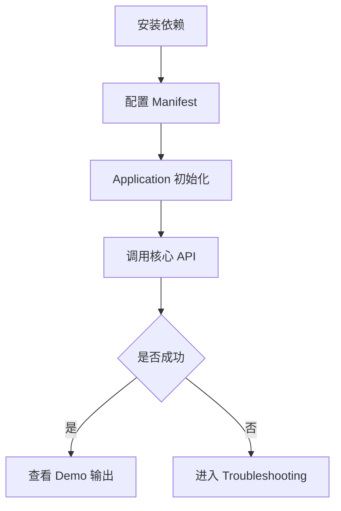

# README / Docs 完整参考

## 目录

- [定位](#定位)
- [完整文档体系](#完整文档体系)
- [单篇文档模板](#单篇文档模板)
- [表达格式优先级](#表达格式优先级)
- [表格写法](#表格写法)
- [树状结构](#树状结构)
- [流程图](#流程图)
- [Demo 写法](#demo-写法)
- [API 参考写法](#api-参考写法)
- [故障排查写法](#故障排查写法)
- [三类文档模板](#三类文档模板)
- [审查清单](#审查清单)

## 定位

这份 reference 用于展开 `aaaaa-xxf-readme-docs` 的完整文档写法。主 `SKILL.md` 负责触发和强制规则，本文件负责承载更完整的文档体系、表达模板和示例结构。

写文档时先判断目标是“文档站体系”还是“单篇文档”：

| What | Why | How |
| --- | --- | --- |
| 文档站体系 | 适合 Android / KMP / SDK / Library 长期维护 | 按概览、快速开始、核心概念、接入指南、使用指南、示例、API 参考、最佳实践、故障排查、迁移指南、版本记录组织 |
| 单篇指南 | 适合某个功能、接入流程、规范或排错主题 | 按目标、背景、适用范围、前置条件、规则、流程、示例、验证和排错组织 |
| 规则 / Skill 文档 | 适合 AI Agent、团队规范、AGENTS.md、CLAUDE.md、SKILL.md、`.mdc` | 先写触发场景，再写强制规则、禁止事项、执行流程、验证清单和输出要求 |

## 完整文档体系

正式 Android / Kotlin / KMP / SDK / Library 文档优先使用这套一级目录：

```text
文档
├── 1. 概览 / Overview
├── 2. 快速开始 / Quick Start
├── 3. 核心概念 / Core Concepts
├── 4. 接入指南 / Integration Guide
├── 5. 使用指南 / Guides
├── 6. 示例 / Examples
├── 7. API 参考 / API Reference
├── 8. 最佳实践 / Best Practices
├── 9. 故障排查 / Troubleshooting
├── 10. 迁移指南 / Migration Guide
└── 11. 版本记录 / Release Notes
```

推荐展开：

```text
文档
├── 1. 概览 / Overview
│   ├── 简介
│   ├── 核心能力
│   ├── 适用场景
│   ├── 系统要求
│   ├── 版本兼容性
│   └── 核心术语
│
├── 2. 快速开始 / Quick Start
│   ├── 环境准备
│   ├── 安装依赖
│   ├── 基础配置
│   ├── 初始化
│   ├── 最小可运行示例
│   └── 验证是否成功
│
├── 3. 核心概念 / Core Concepts
│   ├── 整体架构
│   ├── 模块关系
│   ├── 生命周期
│   ├── 数据模型
│   ├── 线程 / 并发模型
│   ├── 状态管理
│   ├── 错误模型
│   └── 核心术语
│
├── 4. 接入指南 / Integration Guide
│   ├── Gradle 配置
│   ├── 初始化配置
│   ├── Manifest 配置
│   ├── 权限配置
│   ├── ProGuard / R8
│   ├── 多模块接入
│   ├── Android 接入
│   ├── KMP 接入
│   └── 版本兼容
│
├── 5. 使用指南 / Guides
│   ├── 基础使用
│   ├── 配置
│   ├── 网络
│   ├── 缓存
│   ├── 数据存储
│   ├── 生命周期
│   ├── 状态管理
│   ├── 异步 / Flow
│   ├── 错误处理
│   ├── 自定义
│   └── 高级功能
│
├── 6. 示例 / Examples
│   ├── 最小示例
│   ├── 基础示例
│   ├── 完整项目
│   ├── 常见业务场景
│   ├── Android 示例
│   ├── KMP 示例
│   ├── Kotlin 示例
│   └── Java 示例
│
├── 7. API 参考 / API Reference
│   ├── Classes
│   ├── Interfaces
│   ├── Functions
│   ├── Properties
│   ├── Extensions
│   ├── Annotations
│   ├── Configuration
│   ├── Events / Callbacks
│   ├── Error Codes
│   └── Deprecated APIs
│
├── 8. 最佳实践 / Best Practices
│   ├── 推荐架构
│   ├── 模块划分
│   ├── 生命周期管理
│   ├── 线程与并发
│   ├── 性能优化
│   ├── 内存管理
│   ├── 网络
│   ├── 缓存
│   ├── 错误处理
│   ├── 安全
│   ├── 可测试性
│   ├── Do / Don't
│   └── 常见反模式
│
├── 9. 故障排查 / Troubleshooting
│   ├── 常见问题
│   ├── 编译问题
│   ├── 依赖冲突
│   ├── 初始化问题
│   ├── 运行时问题
│   ├── 网络问题
│   ├── 性能问题
│   ├── 日志排查
│   ├── 错误码
│   └── FAQ
│
├── 10. 迁移指南 / Migration Guide
│   ├── Breaking Changes
│   ├── Deprecated API 替换
│   ├── 1.x -> 2.x
│   ├── 2.x -> 3.x
│   └── 迁移检查清单
│
└── 11. 版本记录 / Release Notes
    ├── 当前版本
    ├── 历史版本
    ├── 新增功能
    ├── Bug Fixes
    ├── Breaking Changes
    ├── Deprecated
    └── Known Issues
```

## 单篇文档模板

每篇指南、规范或接入文档优先从下面模板裁剪：

```markdown
# <功能 / 规则名称>

## 目标

## 背景 / 核心概念

## 触发场景 / 适用范围

## 前置条件

## 强制规则

## 禁止事项

## 执行流程

## API / 配置说明

## 示例

## 边界情况 / 异常处理

## 最佳实践

## 常见错误

## 验证 / 审查清单

## 输出要求

## 故障排查

## 相关文档
```

对于规则型文档，最低保留：

```text
目标
触发场景 / 适用范围
前置条件
强制规则
禁止事项
执行流程
边界情况 / 异常处理
验证 / 审查清单
输出要求
故障排查
```

## 表达格式优先级

文档要格式友好，优先使用结构化表达，不要长篇大论。

优先级：

1. 表格：适合解释概念、参数、差异、规则、错误码、版本兼容。
2. 树状结构：适合文档体系、模块关系、文件结构、能力分层。
3. 流程图：适合初始化、调用链、排错路径、迁移步骤、状态切换。
4. 步骤清单：适合 Quick Start、接入流程、迁移流程。
5. Demo：适合展示真实效果、最小可运行路径和完整接入方式。
6. 短段落：只用于承接上下文，不要连续堆多个长段落。

## 表格写法

解释型表格优先使用 `What / Why / How`：

| What | Why | How |
| --- | --- | --- |
| Quick Start | 让用户 5 分钟内跑通 | 只放安装、初始化、最小示例和验证方式 |
| Core Concepts | 避免用户只会复制代码 | 用术语表、模块关系图和生命周期表解释原理 |
| API Reference | 让用户快速查询 | 按类、方法、参数、返回值、异常和示例组织 |

差异比较可以在 `What / Why / How` 后补差异列：

| What | Why | How | Difference | Risk |
| --- | --- | --- | --- | --- |
| `api` dependency | 对外暴露类型 | 用于公共 API 依赖 | 会传递给使用方 | 误用会扩大 ABI |
| `implementation` dependency | 隐藏内部实现 | 用于内部实现依赖 | 不传递给使用方 | 公共 API 引用会编译失败 |

API 参数表：

| 参数 | 类型 | 必填 | 默认值 | What | Why | How |
| --- | --- | --- | --- | --- | --- | --- |
| `context` | `Context` | 是 | 无 | 初始化上下文 | SDK 需要访问应用资源 | 优先传 `applicationContext` |
| `config` | `Config` | 是 | 无 | 初始化配置 | 控制功能开关和环境 | 从业务配置层构造 |

规则表：

| What | Why | How | 禁止事项 |
| --- | --- | --- | --- |
| 写清触发场景 | Agent 才知道什么时候执行 | 放在 description 和正文前部 | 不要只写在正文末尾 |
| 写清验证方式 | 防止只完成表面修改 | 提供命令、截图、日志或检查项 | 不要用“自行验证”代替 |

## 树状结构

用树状结构表达信息架构、模块关系和文件放置位置。

文档结构：

```text
docs/
├── overview.md
├── quick-start.md
├── concepts/
│   ├── lifecycle.md
│   └── threading.md
├── guides/
│   ├── configuration.md
│   └── cache.md
├── api/
│   └── reference.md
└── troubleshooting.md
```

模块关系：

```text
library
├── api        # 公开契约
├── core       # 核心逻辑
├── runtime    # Android 运行时接入
└── sample     # Demo / 示例
```

## 流程图

流程复杂时优先用 Mermaid。Markdown 渲染不支持 Mermaid 的环境，可以降级为 `text` 流程图。

初始化流程：



纯文本降级：

```text
安装依赖
  -> 配置 Manifest
  -> Application 初始化
  -> 调用核心 API
  -> 验证结果
  -> 失败时进入 Troubleshooting
```

排错流程：

```text
编译失败
  -> 检查 Gradle 坐标
  -> 检查 repository
  -> 检查 AGP / Kotlin 版本
  -> 检查依赖冲突
  -> 仍失败则收集完整 Gradle 日志
```

## Demo 写法

Demo 要比抽象说明更直观。正式文档至少保留一个最小 Demo；SDK / Library 文档建议同时提供最小 Demo 和完整 Demo。

Demo 结构：

| What | Why | How |
| --- | --- | --- |
| 最小 Demo | 证明库能跑起来 | 只包含依赖、初始化和一次核心调用 |
| 场景 Demo | 证明常见业务接入方式 | 展示真实 Activity / ViewModel / Repository 调用 |
| 完整 Demo | 证明工程级集成方式 | 提供 sample app、配置、权限、R8、日志和验证步骤 |

Demo 文档模板：

~~~markdown
## Demo: <场景名称>

### 目标

### 前置条件

### 文件结构

```text
sample/
├── build.gradle.kts
├── src/main/AndroidManifest.xml
└── src/main/java/.../MainActivity.kt
```

### Step 1: 添加依赖

### Step 2: 初始化

### Step 3: 调用 API

### Step 4: 验证结果

### 常见失败
~~~

Demo 必须说明验证方式：

| 验证点 | 预期结果 | 失败时检查 |
| --- | --- | --- |
| App 启动 | 无崩溃 | 初始化位置、Manifest、权限 |
| API 调用 | 返回成功或预期错误 | 参数、线程、网络、日志 |
| 日志输出 | 出现指定 tag 或状态 | 日志级别、混淆、初始化顺序 |

## API 参考写法

API Reference 的定位是“查”，不是“学”。不要把整篇教程塞进 API 条目。

推荐结构：

```markdown
## `Client.initialize(...)`

### 签名

### 作用

### 参数

### 返回值

### 异常

### 线程 / 生命周期要求

### 示例

### 注意事项

### 相关 API
```

参数表优先写成：

| 参数 | 类型 | 必填 | 默认值 | What | Why | How |
| --- | --- | --- | --- | --- | --- | --- |
| `token` | `String` | 是 | 无 | 访问凭证 | 服务端鉴权需要 | 从安全配置或服务端下发 |

错误码表：

| Code | What | Why | How | 是否可重试 |
| --- | --- | --- | --- | --- |
| `INIT_REQUIRED` | 未初始化 | 调用 API 早于初始化 | 先调用初始化并检查返回结果 | 是 |
| `PERMISSION_DENIED` | 权限不足 | 缺少运行时权限 | 请求权限后重试 | 是 |

## 故障排查写法

Troubleshooting 要按“现象 -> 原因 -> 检查 -> 解决 -> 验证”组织，不要只列 FAQ。

推荐表格：

| 现象 | What | Why | How | 验证 |
| --- | --- | --- | --- | --- |
| 编译找不到类 | 依赖未接入成功 | Gradle 坐标、repository 或版本不对 | 检查 version catalog、dependency tree 和 repository | `./gradlew :app:dependencies` |
| 初始化后无效果 | 初始化顺序不对 | API 调用早于初始化或进程不一致 | 在 `Application` 初始化并检查多进程 | 查看初始化日志 |
| Release 崩溃 | R8 移除了反射成员 | 缺少 consumer rules 或 keep 规则 | 检查 AAR consumer rules 和 mapping | 跑 minified variant |

单个问题模板：

~~~markdown
### <问题标题>

| What | Why | How |
| --- | --- | --- |
| 现象 | 原因 | 解决方式 |

检查：

1. ...
2. ...
3. ...

验证：

```bash
./gradlew ...
```
~~~

## 三类文档模板

### 教程型

用于 Quick Start、接入教程、功能指南。重点是让读者按顺序完成任务。

```text
目标
前置条件
核心概念
执行流程
示例 / Demo
最佳实践
故障排查
```

### API 型

用于 API Reference。重点是准确、可查、可复制。

```text
概述
API
参数
返回值
异常
线程 / 生命周期
示例
注意事项
相关 API
```

### 规则 / Skill 型

用于 AGENTS.md、CLAUDE.md、SKILL.md、`.mdc`、团队规范和 AI Agent 规则。

```text
目标
触发场景 / 适用范围
前置条件
强制规则
禁止事项
执行流程
边界情况 / 异常处理
验证 / 审查清单
输出要求
故障排查
```

规则型文档的顺序要服务执行：

```text
什么时候触发
  -> 必须做什么
  -> 禁止做什么
  -> 怎么执行
  -> 怎么确认做对了
  -> 最终输出什么
```

## 审查清单

写完后检查：

- 是否有 Overview 说明“这是什么、解决什么问题、适合谁”。
- Quick Start 是否只保留最短可运行路径。
- Core Concepts 是否解释了生命周期、线程、状态、错误模型和核心术语。
- Integration Guide 是否覆盖 Gradle、初始化、Manifest、权限、R8、多模块和版本兼容。
- Guides 是否按功能领域组织，而不是只按“入门 / 进阶 / 高级”堆章节。
- Examples 是否包含最小 Demo、常见场景 Demo 和必要完整 Demo。
- API Reference 是否能独立查询，且签名、参数、返回值、异常来自真实源码。
- Best Practices 是否包含 Do / Don't 和反模式。
- Troubleshooting 是否按“现象、原因、检查、解决、验证”组织。
- Migration Guide 是否包含 Breaking Changes、Deprecated API 替换和迁移检查清单。
- Release Notes 是否区分新增、修复、破坏性变更、废弃和已知问题。
- 是否优先使用表格、树状结构、流程图、步骤清单和 Demo。
- 是否避免连续长段落，必要解释是否拆成 `What / Why / How`。
